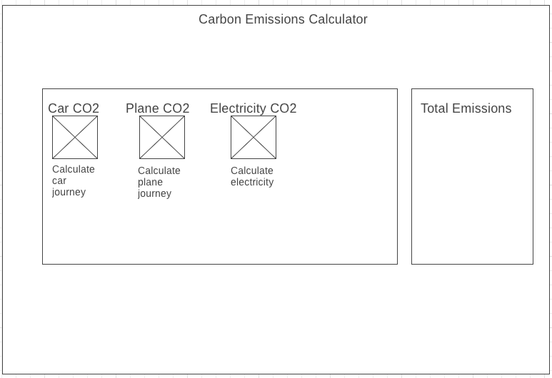
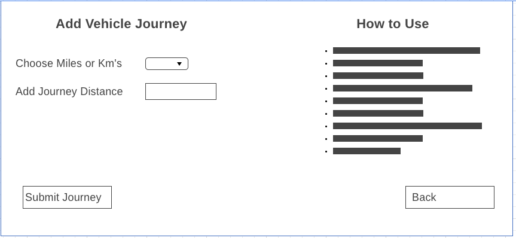

<h1 align="center">

Carbon Catch

</h1>

## Objective
Practice front-end skills using React and Redux connecting to the Carbon Interface API to create an Emissions Calculator

## Progress
 - Setup project React, Axios, Jest, Redux
 - Car component created and connected to API
 - Plane component created and connected to API
 - Electricity component created and connected to API
 - Car & CarEmissionsForm components tested
 - Recharts added to project
 - Hosted [here](https://60927c341b0e2ade3bc01b95--suspicious-perlman-b5fa2d.netlify.app/) on Netlify
 - Plane & PlaneEmissionsForm Components tested  

## Improvements

## Testing (Jest)
To run tests `npm test`
20 passing tests

For Test coverage `npm run test:coverage`

## Installation

1. git clone repository
2. `npm install`
3. `npm start`

## Screenshots
Wireframe of homepage

Form Wireframe

## Tech Stack

React, Redux, Carbon Interface API

## Collaborators
mattybwoy
04alexklink