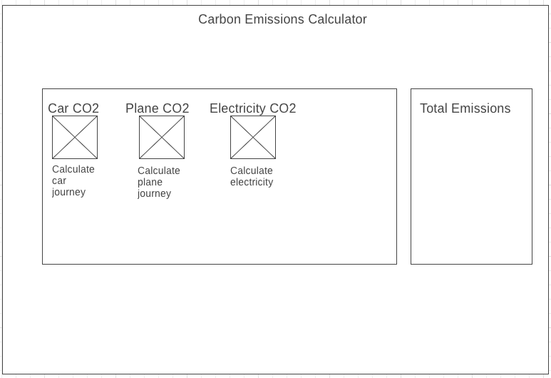

<h1 align="center">

Carbon Catch

</h1>

## Objective
Practice front-end skills using React and Redux connecting to the Carbon Interface API to create an Emissions Calculator

## Progress
 - Setup project React, Axios, Jest, Redux
 - Car component created and connected to API

## Improvements

## Testing (Jest)
To run tests `npm test`
5 passing tests

## Installation

1. git clone repository
2. `npm install`
3. `npm start`

## Screenshots
Wireframe of homepage

## Tech Stack

React, Redux, Carbon Interface API

## Collaborators
mattybwoy
04alexklink